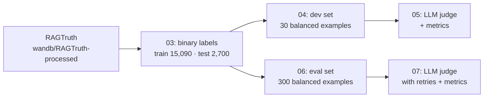

[README (19).md](https://github.com/user-attachments/files/32742774/README.19.md)
# Hallucination Detector

A tool that checks whether an AI-generated answer is actually supported by its source document. Paste a source and an answer; the app uses Claude as a judge to go through the answer claim by claim, flags anything unsupported or contradicted, and returns a verdict of **HALLUCINATION** or **FAITHFUL** with its reasoning.

The judge was benchmarked on **RAGTruth**, a dataset of human-annotated hallucinations in retrieval-augmented generation (RAG) outputs.

---

## The app

`app.py` is a Streamlit app with two inputs:

- **Source context:** the document or facts the answer should be based on.
- **Generated answer:** the text to check.

Claude is asked to list each claim in the answer, mark it as supported, contradicted, or not mentioned in the source, and finish with a one-word verdict on the last line. The app reads that last line to show a red **HALLUCINATION DETECTED** or green **FAITHFUL** result, and the full claim-by-claim reasoning is available under **See reasoning**, so the user can check *why* the verdict was reached.

---

## How it was evaluated



The numbered scripts form the pipeline, in order:

| Script | What it does |
|---|---|
| `01_explore_data.py`, `02_inspect_columns.py` | Load RAGTruth from Hugging Face and inspect its structure and labels |
| `03_build_dataset.py` | Turn RAGTruth's annotations into one binary label per example and save `train_clean.csv` / `test_clean.csv` |
| `04_make_dev_set.py` | Sample a small, balanced development set (15 hallucinated + 15 faithful) from the test split |
| `05_llm_judge.py` | Run the judge on the dev set and report accuracy, precision, recall, F1 and the confusion matrix |
| `06_make_bigger_eval_set.py` | Sample a larger balanced evaluation set (150 + 150) from the test split |
| `07_llm_judge_full.py` | Run the judge on all 300, with retries and backoff for API errors; failed examples are excluded from scoring and reported |

**Labels.** RAGTruth marks each answer with the types of hallucination it contains. An example is labelled a hallucination (`1`) if it has an *evident conflict* (contradicts the source) or *baseless information* (adds claims the source doesn't support), and faithful (`0`) otherwise. The test split covers three RAG task types equally: question answering, summarization, and data-to-text.

**Balanced sampling.** The test split is only about 35% hallucinated, so the evaluation sets are sampled 50/50. That makes precision and recall easy to compare, but it means the scores describe performance on a balanced mix, not on RAGTruth's natural distribution. Sampling uses a fixed seed (`random_state=42`), so the sets are reproducible.

**Judge.** Claude (`claude-sonnet-4-6`) receives the context and the answer and must reply with a single word, `HALLUCINATION` or `FAITHFUL`. Correctness is then scored in code against the human labels, with scikit-learn.

---

## Results

### Development set (30 examples)

| Metric | Score |
|---|---|
| Accuracy | 96.7% (29/30) |
| Precision | 93.8% |
| Recall | 100% |
| F1 | 96.8% |

|  | Predicted faithful | Predicted hallucination |
|---|---|---|
| **Actually faithful** | 14 | 1 |
| **Actually hallucinated** | 0 | 15 |

The judge caught every hallucination. Its one mistake was a false alarm on a summarization example, flagging a faithful answer as a hallucination.

**How much to trust this.** Thirty examples is a small sample: the 95% confidence interval for the accuracy is roughly **83% to 99%**. The dev set was used to develop the approach, and the larger evaluation below is the better estimate.

### Evaluation set (300 examples)

| Metric | Score |
|---|---|
| Accuracy | *[add from the 07 run]* |
| Precision | *[add]* |
| Recall | *[add]* |
| F1 | *[add]* |

Produced by `07_llm_judge_full.py`, which writes predictions to `eval_set_300_with_predictions.csv`.

### What was and wasn't measured

The benchmark evaluates the **one-word judge** in scripts 05 and 07. The app uses a more detailed **claim-by-claim** prompt, which asks the model to reason about each claim before giving its verdict. That generally helps on longer answers, but it hasn't been benchmarked yet, so the numbers above describe the simpler judge rather than the exact prompt in the app.

---

## Project structure

| File | Purpose |
|---|---|
| `app.py` | Streamlit app with the claim-by-claim judge |
| `01_…` to `07_…` | Data preparation and evaluation pipeline (above) |
| `dev_set.csv`, `dev_set_with_predictions.csv` | The 30-example dev set, and the judge's predictions on it |
| `eval_set_300.csv` | The 300-example evaluation set |
| `train_clean.csv`, `test_clean.csv` | RAGTruth with binary labels (produced by `03_build_dataset.py`) |
| `requirements.txt` | Python dependencies |

---

## Running locally

```bash
git clone https://github.com/saratheiranian/hallucination-detector.git
cd hallucination-detector
python3 -m venv .venv
source .venv/bin/activate
pip install -r requirements.txt
```

Add your Anthropic API key (from [console.anthropic.com](https://console.anthropic.com)) to a `.env` file, which is git-ignored:

```bash
echo 'ANTHROPIC_API_KEY=your-key-here' > .env
```

Run the app:

```bash
python -m streamlit run app.py
```

### Reproducing the evaluation

The data scripts also need the Hugging Face `datasets` library:

```bash
pip install datasets
python 03_build_dataset.py
python 04_make_dev_set.py && python 05_llm_judge.py
python 06_make_bigger_eval_set.py && python 07_llm_judge_full.py
```

Scripts 05 and 07 make one Claude API call per example (30 and 300 calls), which uses API credit.

---

## Limitations and next steps

- **Benchmark the app's prompt.** Run the claim-by-claim judge on the same 300 examples and compare it with the one-word judge, to see whether step-by-step reasoning actually improves accuracy.
- **Results per task type.** Break the scores down by question answering, summarization, and data-to-text; the dev set's only error was on a summary, and the task types may differ in difficulty.
- **Compare with baselines.** Measure against simpler detectors, such as a natural-language-inference model, to show what the LLM judge adds and at what cost.
- **Finer-grained detection.** RAGTruth annotates the exact text spans that are hallucinated. The judge currently gives one verdict per answer; predicting *which* sentences are unsupported would be more useful to users.
- **One label for two error types.** Contradictions and unsupported additions are merged into a single label. Reporting them separately would show which kind the judge misses.
- **Verdict parsing.** The app reads the verdict from the last line of the model's reply. Structured output (for example, tool use with a fixed schema) would make that more robust.

---

## Data

RAGTruth: Niu et al., *RAGTruth: A Hallucination Corpus for Developing Trustworthy Retrieval-Augmented Language Models* (ACL 2024), used via the Hugging Face dataset [`wandb/RAGTruth-processed`](https://huggingface.co/datasets/wandb/RAGTruth-processed). Please see the dataset page for its licence and terms of use.

---

Built by Sara Ghassemi. Powered by Claude (Anthropic).
